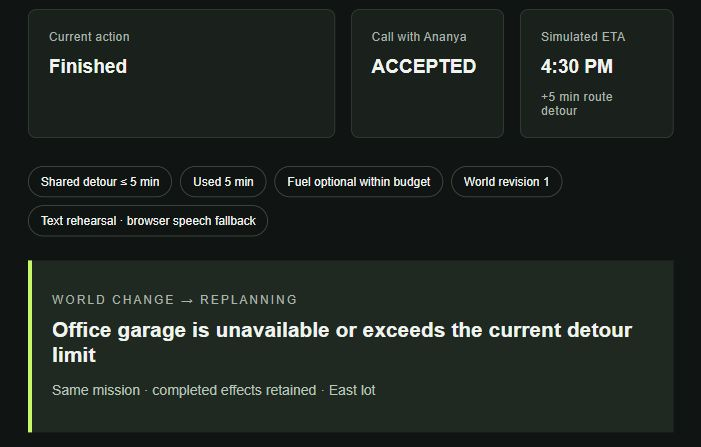

# DRIVEOS

**You drive. It handles everything around the drive.**

DriveOS is a voice-first mission execution layer for people whose hands and attention are occupied. One compound goal becomes a persistent, accountable mission that executes bounded actions and recovers when the world changes.



**Prisma hears. DriveOS executes. Timbre speaks.**

## Why voice matters

A delay creates work across several apps: notify someone, agree a new time, check parking, decide whether fuel fits and update the ETA. Voice captures the whole goal in one interaction; DriveOS remembers it while external state changes. The console makes that execution inspectable. Demonstrate this prototype while stationary; production driving support is unverified.

## The signature mission

> I'm running late for my meeting. Tell Ananya, ask if 4:30 works, find parking near her office, and get fuel if it doesn't add more than five minutes.

Click **Run changing-world demo** for a deterministic text rehearsal. Synthetic CallPilot dials, rings, connects and returns an acceptance. The calendar updates. The engine selects a garage candidate; the world makes it unavailable before verification. The same mission selects East lot, checks fuel against the remaining shared budget and completes with five added minutes and a simulated 4:30 ETA. Completed contact/calendar work stays completed.

Use **Reset demo** to clear the console, or launch any preset into a fresh isolated world. **Judge mode** includes counter-offers, bounded no-answer, over-budget fuel, changed requirements, service failure and late arrival. **Mission Record** shows persisted events and exports JSON. Replay controls demonstrate duplicate request recovery and stale command rejection through the actual API.

The text rehearsal uses labeled browser speech fallback. **Start Gnani voice mission** captures mono WAV, displays the actual Prisma transcript after conservative normalization, executes the same changing-world flow and requests real Timbre start/final audio. It requires configured credentials, sufficient credits and at least three remaining requests. Autoplay may require pressing play.

Open **Voice settings**, select English, Kannada or Hinglish and expand **What to say** for the finite supported fixtures. Names, time and the five-minute limit are preserved; unsupported goals escalate. Completion speech is currently English. The secondary **Personal example** safely escalates pharmacy/stock work outside the frozen tool contract.

[60-second demo script](docs/demo-script.md) · [Measured submission evidence](docs/submission-evidence.md)

## Architecture

**The reasoning component is replaceable; execution, policy, persistence and recovery belong to DriveOS.**

```text
Microphone → Prisma → Mission Interpreter → frozen schema → DriveOS policy
                                                              ↓
                  SQLite persistence ↔ Mission Engine → synthetic services
                                           ↑                 ↓
                                     affected-task replan ← world changes
                                           ↓
                                 Timbre → spoken outcome
```

The interpreter proposes; policy validates; the engine owns state and execution. Operational explanations show the trigger, affected tasks, verified alternative and constraint impact. They are system events, not hidden reasoning traces.

[Architecture diagram](docs/architecture.md) · [Technical design](docs/technical-design.md)

## Mission Engine and safety

Stable mission/task identities, dependency histories and incremental SQLite transactions support pause, reload and API restart. Semantic effect identities and bound command fingerprints prevent duplicate synthetic effects under tested replay conditions. Revision checks reject stale commands. A counter-offer needs the exact displayed approval before a calendar change. Failures preserve earlier commits; recovery reopens affected tasks only. No-answer attempts are bounded to two. Late arrival escalates honestly.

These are local synthetic execution guarantees. Real external providers would need their own idempotency and timeout reconciliation. The frozen v1 schema is unchanged.

## Gnani integrations and honest scope

| Component | Implementation / status |
|---|---|
| Prisma v2.5 | Real backend transcription via `POST /stt/v3` |
| Timbre v2.5 | Real backend WAV synthesis via `POST /api/v1/tts/inference` |
| DriveOS Mission Interpreter | Deterministic finite matcher, implemented by **MockEvon**, no inference |
| MockEvon | Local interpreter/test planner; not hosted Evon |
| Hosted Evon | Optional insertion through the frozen contract; endpoint/inference unverified |
| External tools | Synthetic CallPilot, calendar, parking, fuel and maps |

No live calls, bookings, purchases or navigation occur. No substitute LLM or paid infrastructure was added. Credentials remain backend-only. [Integration contracts](docs/gnani-integration.md)

## Evaluation

Measured refinement results on **2026-10-04**: **60 passing tests**, **27/27 offline mission outcomes**, **13/13 supported completion runs**, and **13/13 chaos checks**, including two real API process launches proving exact-state recovery. Replay evaluation recorded zero duplicate notification effects and zero unsafe tool effects. Production frontend build passes.

Offline latency and denominators are in [submission evidence](docs/submission-evidence.md) and the [machine-readable snapshot](docs/evaluation-evidence.json). Offline engine checks, real provider observations and human microphone validation are kept separate.

Historical real Prisma/Timbre checks completed English and Kannada v2 missions with synthetic input audio. No fresh provider calls were made in this pass: the configured local allowance has one request remaining. Human microphone completion/listening and real Hinglish v2 remain unverified.

## Known limitations

Finite fixture interpretation; synthetic external facts/actions; English summaries; local unauthenticated API; browser-driven demo clock; SQLite planning lock; caches without expiry. No production driving validation, noisy-car measurement, verified hosted Evon or real external-effect reconciliation. Closing the console pauses progression while state remains saved.

## Run locally

From the repository root, with Python and Node.js installed:

```powershell
python -m venv .venv
.\.venv\Scripts\python -m pip install -r requirements.txt
.\.venv\Scripts\python -m uvicorn app.api.main:app --reload --host 127.0.0.1 --port 8000
```

In another terminal:

```powershell
cd app/web
npm ci
npm run dev
```

Open [DriveOS](http://127.0.0.1:3000). Text demos require no credentials. For real speech, copy `.env.example` to `.env`, set backend `GNANI_API_KEY` and restart the API. Check provider credits before changing the local request allowance; it is not a credit balance. SQLite state, transcripts and audio remain in ignored `data/`.

## Reproduce the evidence

```powershell
python -m unittest discover -s tests -v
python -m app.evaluation.runners.evaluate
python -m app.evaluation.runners.chaos
python -m app.evaluation.runners.mission_demo
python -m app.evaluation.runners.secret_scan
cd app/web
npm run build
```

`chaos` includes the automatic API restart check. Real-provider commands and the remaining microphone gate are documented in [submission evidence](docs/submission-evidence.md).
